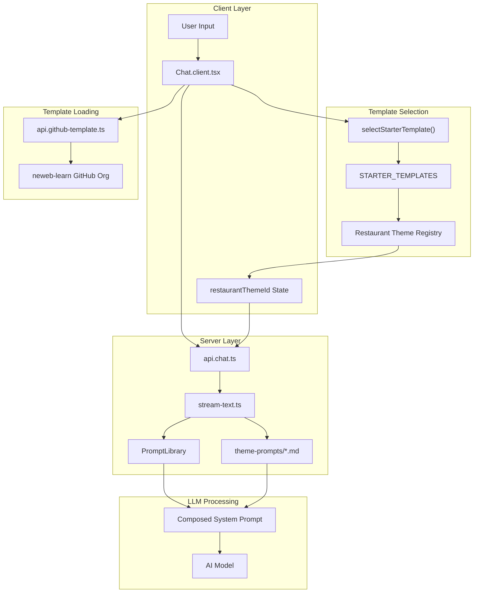

# Restaurant Website Generator - Theme Integration Architecture

## Executive Summary

This document outlines the architecture for integrating restaurant-specific theme prompts into the website generator. The solution adds a new **Theme Prompt Layer** that enhances the LLM's ability to generate domain-specific, high-quality restaurant websites by combining:

1. **Restaurant Template Selection** - Matching user requests to appropriate restaurant themes
2. **Template Loading** - Fetching pre-built restaurant templates from GitHub
3. **Theme Prompt Injection** - Adding theme-specific design and content guidance to the system prompt

---

## Current State Analysis

### Existing Flow
```
User Input → Template Selection (LLM) → Template Loading (GitHub) → LLM Generation
```

### Current Components
| Component | Location | Purpose |
|-----------|----------|---------|
| Template Selection | `app/utils/selectStarterTemplate.ts` | LLM-powered selection of framework templates |
| Template Registry | `app/utils/constants.ts` | `STARTER_TEMPLATES` array with 14 generic templates |
| Template Loading | `app/routes/api.github-template.ts` | Fetches template files from GitHub |
| System Prompts | `app/lib/common/prompts/` | Base system prompts for LLM |
| Theme Prompts | `app/theme-prompts/*.md` | 12 restaurant-specific design guides (unused) |
| Chat Flow | `app/components/chat/Chat.client.tsx` | Orchestrates template selection and chat |
| LLM Streaming | `app/lib/.server/llm/stream-text.ts` | Composes system prompt and streams LLM |

### Gap Analysis
- Theme prompts exist but are **not integrated** into the LLM flow
- Template selection only covers generic frameworks (React, Vue, etc.)
- No restaurant-specific templates in `STARTER_TEMPLATES`
- No mechanism to inject theme prompts into the system prompt

---

## Proposed Architecture

### New Flow
```
User Input (e.g., "generate chinese restaurant")
    ↓
Template Selection (Enhanced LLM)
    ↓ Returns: { templateName: "Bamboo Bistro", title: "..." }
    ↓
Resolve Restaurant Theme ID
    ↓ Maps: "Bamboo Bistro" → "bamboobistro"
    ↓
Template Loading (neweb-learn GitHub)
    ↓ Fetches: template files from neweb-learn/Bamboobistro
    ↓
Chat API Call
    ↓ Includes: restaurantThemeId in request body
    ↓
System Prompt Composition
    ↓ Layers:
    │   1. Base System Prompt (tools, constraints, design)
    │   2. Theme Prompt Layer (Bamboobistro.md content)
    ↓
LLM Generation
    ↓ Produces: Restaurant website following theme guidelines
```

### Architecture Diagram



---

## Implementation Plan

### Prerequisites

Before implementing, verify the following:

1. **Vite Raw Import Support** - Already enabled by default in Vite. The `?raw` suffix imports files as strings.

2. **Theme Prompt Files Exist** - All 12 files must be present in `app/theme-prompts/`:
   ```
   Artisanhearthv3.md, Bamboobistro.md, Boldfeastv2.md, Chromaticstreet.md,
   Classicminimalistv2.md, Dynamicfusion.md, Freshmarket.md, Gastrobotanical.md,
   Indochineluxe.md, Noirluxev3.md, SaiGonveranda.md, Therednoodle.md
   ```

3. **GitHub Repositories** - Ensure `neweb-learn` org has all 12 template repos accessible.

---

### Phase 1: Type Definitions and Registry

#### 1.1 Extend Template Interface
**File:** `app/types/template.ts`

```typescript
export interface Template {
  name: string;
  label: string;
  description: string;
  githubRepo: string;
  tags?: string[];
  icon?: string;
  
  // NEW: Restaurant-specific fields
  category?: 'generic' | 'restaurant';
  restaurantThemeId?: RestaurantThemeId;
}
```

#### 1.2 Create Restaurant Theme Type
**File:** `app/types/restaurant-theme.ts` (new)

```typescript
export type RestaurantThemeId =
  | 'artisanhearthv3'
  | 'bamboobistro'
  | 'boldfeastv2'
  | 'chromaticstreet'
  | 'classicminimalistv2'
  | 'dynamicfusion'
  | 'freshmarket'
  | 'gastrobotanical'
  | 'indochineluxe'
  | 'noirluxev3'
  | 'saigonveranda'
  | 'therednoodle';

export interface RestaurantTheme {
  id: RestaurantThemeId;
  label: string;
  description: string;
  cuisines: string[];      // e.g., ['asian', 'chinese', 'ramen']
  styleTags: string[];     // e.g., ['casual', 'fine-dining']
  templateName: string;    // Must match STARTER_TEMPLATES.name
  prompt: string;          // Raw markdown content
}
```

#### 1.3 Create Theme Registry
**File:** `app/theme-prompts/registry.ts` (new)

> **Note:** The `?raw` suffix is a Vite feature for importing files as raw strings. This is built-in for Vite projects and requires no additional configuration.

```typescript
import type { RestaurantTheme, RestaurantThemeId } from '~/types/restaurant-theme';

// Import theme prompts as raw markdown (Vite ?raw import)
// File names must match exactly (case-sensitive on Unix systems)
import ArtisanHearthPrompt from './Artisanhearthv3.md?raw';
import BambooBistroPrompt from './Bamboobistro.md?raw';
import BoldFeastPrompt from './Boldfeastv2.md?raw';
import ChromaticStreetPrompt from './Chromaticstreet.md?raw';
import ClassicMinimalistPrompt from './Classicminimalistv2.md?raw';
import DynamicFusionPrompt from './Dynamicfusion.md?raw';
import FreshMarketPrompt from './Freshmarket.md?raw';
import GastroBotanicalPrompt from './Gastrobotanical.md?raw';
import IndochineLuxePrompt from './Indochineluxe.md?raw';
import NoirLuxePrompt from './Noirluxev3.md?raw';
import SaigonVerandaPrompt from './SaiGonveranda.md?raw'; // Note: capital 'G' matches filename
import TheRedNoodlePrompt from './Therednoodle.md?raw';

export const RESTAURANT_THEMES: RestaurantTheme[] = [
  {
    id: 'bamboobistro',
    label: 'The Bamboo Bistro (Asian Casual)',
    description: 'Modern Asian casual dining - night market vibes with zen aesthetics',
    cuisines: ['asian', 'chinese', 'ramen', 'thai', 'japanese', 'izakaya', 'dim-sum'],
    styleTags: ['casual', 'energetic', 'night-market', 'modern'],
    templateName: 'Bamboo Bistro',
    prompt: BambooBistroPrompt,
  },
  {
    id: 'indochineluxe',
    label: 'The Indochine Luxe (High-end Vietnamese)',
    description: 'Luxury Vietnamese heritage dining with French colonial influences',
    cuisines: ['vietnamese', 'french-vietnamese', 'saigon', 'pho'],
    styleTags: ['fine-dining', 'luxury', 'heritage', 'elegant'],
    templateName: 'Indochine Luxe',
    prompt: IndochineLuxePrompt,
  },
  {
    id: 'therednoodle',
    label: 'The Red Noodle (Street Food)',
    description: 'Vibrant street food experience with bold red accents',
    cuisines: ['asian', 'noodles', 'street-food', 'casual'],
    styleTags: ['vibrant', 'street-food', 'casual', 'bold'],
    templateName: 'The Red Noodle',
    prompt: TheRedNoodlePrompt,
  },
  {
    id: 'saigonveranda',
    label: 'Saigon Veranda (Relaxed Vietnamese)',
    description: 'Relaxed outdoor Vietnamese dining experience',
    cuisines: ['vietnamese', 'casual', 'family-style'],
    styleTags: ['relaxed', 'outdoor', 'family', 'veranda'],
    templateName: 'Saigon Veranda',
    prompt: SaigonVerandaPrompt,
  },
  {
    id: 'artisanhearthv3',
    label: 'The Artisan Hearth (The Neighbor)',
    description: 'Warm, artisanal neighborhood restaurant feel',
    cuisines: ['american', 'european', 'farm-to-table', 'artisan'],
    styleTags: ['warm', 'neighborhood', 'artisan', 'cozy'],
    templateName: 'Artisan Hearth',
    prompt: ArtisanHearthPrompt,
  },
  {
    id: 'classicminimalistv2',
    label: 'Classic Minimalist (Elegant Modern)',
    description: 'Clean, minimalist design for sophisticated dining',
    cuisines: ['western', 'international', 'modern'],
    styleTags: ['minimalist', 'elegant', 'clean', 'modern'],
    templateName: 'Classic Minimalist',
    prompt: ClassicMinimalistPrompt,
  },
  {
    id: 'dynamicfusion',
    label: 'Dynamic Fusion (The Alchemist)',
    description: 'Contemporary fusion restaurant with experimental vibes',
    cuisines: ['fusion', 'experimental', 'contemporary'],
    styleTags: ['dynamic', 'fusion', 'experimental', 'creative'],
    templateName: 'Dynamic Fusion',
    prompt: DynamicFusionPrompt,
  },
  {
    id: 'boldfeastv2',
    label: 'Bold Feast (Vibrant Dining)',
    description: 'Bold, vibrant dining experience with strong visual presence',
    cuisines: ['american', 'bbq', 'steakhouse', 'comfort-food'],
    styleTags: ['bold', 'vibrant', 'feast', 'hearty'],
    templateName: 'Bold Feast',
    prompt: BoldFeastPrompt,
  },
  {
    id: 'freshmarket',
    label: 'Fresh Market (Farm Fresh)',
    description: 'Fresh, market-inspired restaurant design',
    cuisines: ['organic', 'salads', 'healthy', 'farm-fresh'],
    styleTags: ['fresh', 'market', 'organic', 'healthy'],
    templateName: 'Fresh Market',
    prompt: FreshMarketPrompt,
  },
  {
    id: 'gastrobotanical',
    label: 'Gastro Botanical (Fine Dining)',
    description: 'Fine dining with botanical and nature elements',
    cuisines: ['fine-dining', 'tasting-menu', 'botanical'],
    styleTags: ['botanical', 'fine-dining', 'nature', 'refined'],
    templateName: 'Gastro Botanical',
    prompt: GastroBotanicalPrompt,
  },
  {
    id: 'noirluxev3',
    label: 'Noir Luxe (Dark Premium)',
    description: 'Dark, luxurious premium dining experience',
    cuisines: ['steakhouse', 'cocktails', 'premium'],
    styleTags: ['dark', 'luxury', 'premium', 'noir'],
    templateName: 'Noir Luxe',
    prompt: NoirLuxePrompt,
  },
  {
    id: 'chromaticstreet',
    label: 'Chromatic Street (Colorful Street Food)',
    description: 'Colorful, street-food aesthetic with urban vibes',
    cuisines: ['street-food', 'tacos', 'multicultural'],
    styleTags: ['colorful', 'street', 'urban', 'casual'],
    templateName: 'Chromatic Street',
    prompt: ChromaticStreetPrompt,
  },
];

// Utility functions
export function getThemeByTemplateName(templateName: string): RestaurantTheme | undefined {
  return RESTAURANT_THEMES.find((t) => t.templateName === templateName);
}

export function getThemeById(themeId: RestaurantThemeId): RestaurantTheme | undefined {
  return RESTAURANT_THEMES.find((t) => t.id === themeId);
}

export function getThemePrompt(themeId: RestaurantThemeId): string | null {
  const theme = getThemeById(themeId);
  return theme?.prompt ?? null;
}

export function getThemeList(): Array<{ id: RestaurantThemeId; label: string; cuisines: string[] }> {
  return RESTAURANT_THEMES.map(({ id, label, cuisines }) => ({ id, label, cuisines }));
}
```

---

### Phase 2: Template Registry Updates

#### 2.1 Add Restaurant Templates to Constants
**File:** `app/utils/constants.ts`

Add 12 restaurant templates to `STARTER_TEMPLATES`:

```typescript
export const STARTER_TEMPLATES: Template[] = [
  // ========== RESTAURANT TEMPLATES ==========
  {
    name: 'Bamboo Bistro',
    label: 'Bamboo Bistro (Asian Casual)',
    description: 'Modern Asian casual dining website - ramen bars, dim sum, izakayas. Night market vibes with zen aesthetics.',
    githubRepo: 'neweb-learn/Bamboobistro',
    tags: ['restaurant', 'asian', 'chinese', 'ramen', 'thai', 'japanese', 'casual', 'night-market', 'food', 'dining'],
    icon: 'i-bolt:restaurant',
    category: 'restaurant',
    restaurantThemeId: 'bamboobistro',
  },
  {
    name: 'Indochine Luxe',
    label: 'Indochine Luxe (High-end Vietnamese)',
    description: 'Luxury Vietnamese heritage dining website with French colonial influences. Perfect for upscale pho, banh mi restaurants.',
    githubRepo: 'neweb-learn/Indochineluxe',
    tags: ['restaurant', 'vietnamese', 'luxury', 'fine-dining', 'heritage', 'pho', 'french-vietnamese', 'elegant'],
    icon: 'i-bolt:restaurant',
    category: 'restaurant',
    restaurantThemeId: 'indochineluxe',
  },
  {
    name: 'The Red Noodle',
    label: 'The Red Noodle (Street Food)',
    description: 'Vibrant street food restaurant website with bold red accents. Perfect for noodle shops, quick-service Asian.',
    githubRepo: 'neweb-learn/Therednoodle',
    tags: ['restaurant', 'noodles', 'street-food', 'asian', 'casual', 'quick-service', 'vibrant'],
    icon: 'i-bolt:restaurant',
    category: 'restaurant',
    restaurantThemeId: 'therednoodle',
  },
  {
    name: 'Saigon Veranda',
    label: 'Saigon Veranda (Relaxed Vietnamese)',
    description: 'Relaxed outdoor Vietnamese dining website. Perfect for family-style restaurants, veranda dining concepts.',
    githubRepo: 'neweb-learn/Saigonveranda',
    tags: ['restaurant', 'vietnamese', 'casual', 'family', 'outdoor', 'veranda', 'relaxed'],
    icon: 'i-bolt:restaurant',
    category: 'restaurant',
    restaurantThemeId: 'saigonveranda',
  },
  {
    name: 'Artisan Hearth',
    label: 'Artisan Hearth (The Neighbor)',
    description: 'Warm, artisanal neighborhood restaurant website. Perfect for farm-to-table, local bistros, comfort food.',
    githubRepo: 'neweb-learn/Artisanhearthv3',
    tags: ['restaurant', 'american', 'artisan', 'farm-to-table', 'neighborhood', 'cozy', 'comfort-food'],
    icon: 'i-bolt:restaurant',
    category: 'restaurant',
    restaurantThemeId: 'artisanhearthv3',
  },
  {
    name: 'Classic Minimalist',
    label: 'Classic Minimalist (Elegant Modern)',
    description: 'Clean, minimalist restaurant website design. Perfect for modern bistros, contemporary dining.',
    githubRepo: 'neweb-learn/Classicminimalistv2',
    tags: ['restaurant', 'minimalist', 'modern', 'elegant', 'clean', 'contemporary', 'western'],
    icon: 'i-bolt:restaurant',
    category: 'restaurant',
    restaurantThemeId: 'classicminimalistv2',
  },
  {
    name: 'Dynamic Fusion',
    label: 'Dynamic Fusion (The Alchemist)',
    description: 'Contemporary fusion restaurant website. Perfect for experimental cuisine, chef-driven concepts.',
    githubRepo: 'neweb-learn/Dynamicfusion',
    tags: ['restaurant', 'fusion', 'experimental', 'contemporary', 'creative', 'chef-driven'],
    icon: 'i-bolt:restaurant',
    category: 'restaurant',
    restaurantThemeId: 'dynamicfusion',
  },
  {
    name: 'Bold Feast',
    label: 'Bold Feast (Vibrant Dining)',
    description: 'Bold, vibrant restaurant website with strong visual presence. Perfect for BBQ, steakhouse, hearty cuisine.',
    githubRepo: 'neweb-learn/Boldfeastv2',
    tags: ['restaurant', 'bbq', 'steakhouse', 'american', 'bold', 'feast', 'comfort-food'],
    icon: 'i-bolt:restaurant',
    category: 'restaurant',
    restaurantThemeId: 'boldfeastv2',
  },
  {
    name: 'Fresh Market',
    label: 'Fresh Market (Farm Fresh)',
    description: 'Fresh, market-inspired restaurant website. Perfect for organic cafes, salad bars, healthy dining.',
    githubRepo: 'neweb-learn/Freshmarket',
    tags: ['restaurant', 'organic', 'healthy', 'salads', 'farm-fresh', 'cafe', 'market'],
    icon: 'i-bolt:restaurant',
    category: 'restaurant',
    restaurantThemeId: 'freshmarket',
  },
  {
    name: 'Gastro Botanical',
    label: 'Gastro Botanical (Fine Dining)',
    description: 'Fine dining restaurant website with botanical elements. Perfect for tasting menus, chef tables.',
    githubRepo: 'neweb-learn/Gastrobotanical',
    tags: ['restaurant', 'fine-dining', 'botanical', 'tasting-menu', 'upscale', 'nature'],
    icon: 'i-bolt:restaurant',
    category: 'restaurant',
    restaurantThemeId: 'gastrobotanical',
  },
  {
    name: 'Noir Luxe',
    label: 'Noir Luxe (Dark Premium)',
    description: 'Dark, luxurious premium restaurant website. Perfect for cocktail bars, steakhouses, speakeasies.',
    githubRepo: 'neweb-learn/Noirluxev3',
    tags: ['restaurant', 'luxury', 'dark', 'premium', 'steakhouse', 'cocktails', 'speakeasy', 'noir'],
    icon: 'i-bolt:restaurant',
    category: 'restaurant',
    restaurantThemeId: 'noirluxev3',
  },
  {
    name: 'Chromatic Street',
    label: 'Chromatic Street (Colorful Street Food)',
    description: 'Colorful street food restaurant website with urban vibes. Perfect for tacos, multicultural quick-serve.',
    githubRepo: 'neweb-learn/Chromaticstreet',
    tags: ['restaurant', 'street-food', 'tacos', 'colorful', 'urban', 'casual', 'multicultural'],
    icon: 'i-bolt:restaurant',
    category: 'restaurant',
    restaurantThemeId: 'chromaticstreet',
  },

  // ========== EXISTING GENERIC TEMPLATES ==========
  {
    name: 'Expo App',
    // ... existing template
  },
  // ... rest of existing templates
];
```

---

### Phase 3: Template Selection Enhancement

#### 3.1 Update Template Selection Prompt
**File:** `app/utils/selectStarterTemplate.ts`

Enhance the selection prompt to prioritize restaurant templates:

```typescript
const starterTemplateSelectionPrompt = (templates: Template[]) => `
You are an experienced developer who helps people choose the best starter template for their projects.
IMPORTANT: Vite is preferred
IMPORTANT: Only choose shadcn templates if the user explicitly asks for shadcn.

## SPECIAL RULES FOR RESTAURANT WEBSITES
When the user mentions ANY of these, you MUST prefer restaurant-tagged templates:
- Restaurant, cafe, bistro, bar, diner, eatery, dining
- Cuisines: Chinese, Vietnamese, Thai, Japanese, Asian, Italian, Mexican, American, BBQ
- Food concepts: noodles, pho, sushi, tacos, steakhouse, fine dining, casual dining
- Food business terms: menu, reservations, chef, kitchen, food, cuisine

Match the cuisine and style as closely as possible using template descriptions and tags.
Only fall back to generic templates (e.g., "Vite React") if no restaurant template fits.

Available templates:
<template>
  <name>blank</name>
  <description>Empty starter for simple scripts and trivial tasks that don't require a full template setup</description>
  <tags>basic, script</tags>
</template>
${templates
  .map(
    (template) => \`
<template>
  <name>\${template.name}</name>
  <description>\${template.description}</description>
  \${template.tags ? \`<tags>\${template.tags.join(', ')}</tags>\` : ''}
  \${template.category ? \`<category>\${template.category}</category>\` : ''}
</template>
\`,
  )
  .join('\n')}

Response Format:
<selection>
  <templateName>{selected template name}</templateName>
  <title>{a proper title for the project}</title>
</selection>

Examples:

<example>
User: I need to build a chinese restaurant website
Response:
<selection>
  <templateName>Bamboo Bistro</templateName>
  <title>Golden Dragon Chinese Restaurant</title>
</selection>
</example>

<example>
User: Create a luxury Vietnamese pho restaurant site
Response:
<selection>
  <templateName>Indochine Luxe</templateName>
  <title>Saigon Heritage Pho House</title>
</selection>
</example>

<example>
User: I need to build a todo app
Response:
<selection>
  <templateName>react-basic-starter</templateName>
  <title>Simple React todo application</title>
</selection>
</example>

<example>
User: Write a script to generate numbers from 1 to 100
Response:
<selection>
  <templateName>blank</templateName>
  <title>script to generate numbers from 1 to 100</title>
</selection>
</example>

Instructions:
1. For restaurant/food/dining requests, ALWAYS recommend a restaurant category template
2. Match cuisine and style tags to user request as closely as possible
3. For trivial tasks and simple scripts, use blank template
4. For non-restaurant complex projects, use appropriate generic templates
5. Follow the exact XML format
6. Consider both technical requirements and tags
7. If no perfect match exists, recommend the closest option

Important: Provide only the selection tags in your response, no additional text.
MOST IMPORTANT: YOU DONT HAVE TIME TO THINK JUST START RESPONDING BASED ON HUNCH 
`;
```

---

### Phase 4: Client-Side State Management

#### 4.1 Add Restaurant Theme State
**File:** `app/components/chat/Chat.client.tsx`

> **Important:** The `restaurantThemeId` must be included in the `useChat` hook's `body` option so it's sent with every chat API request.

```typescript
// ============================================================
// STEP 1: Add imports at the top of the file
// ============================================================
import { STARTER_TEMPLATES } from '~/utils/constants';
import type { RestaurantThemeId } from '~/types/restaurant-theme';

// ============================================================
// STEP 2: Add state inside ChatImpl component (around line 94)
// ============================================================
const [restaurantThemeId, setRestaurantThemeId] = useState<RestaurantThemeId | null>(null);

// ============================================================
// STEP 3: Add restaurantThemeId to useChat body (around line 120)
// This ensures the theme ID is sent with every chat request
// ============================================================
const {
  messages,
  isLoading,
  input,
  handleInputChange,
  setInput,
  stop,
  append,
  setMessages,
  reload,
  error,
  data,
  addToolResult,
} = useChat({
  api: '/api/chat',
  body: {
    apiKeys,
    files,
    promptId,
    contextOptimization: contextOptimizationEnabled,
    chatMode,
    designScheme,
    restaurantThemeId, // NEW: Include theme ID in request body
    supabase: {
      isConnected: supabaseConn?.isConnected || false,
      hasSelectedProject: !!selectedProject,
      credentials: selectedProject
        ? { anonKey: selectedProject.anonKey, supabaseUrl: selectedProject.apiUrl }
        : undefined,
    },
    maxLLMSteps: mcpSettings.maxLLMSteps,
  },
  sendExtraMessageFields: true,
  // ... rest of useChat options unchanged
});

// ============================================================
// STEP 4: Update sendMessage function (around line 415-476)
// After template selection succeeds, resolve and set the theme ID
// ============================================================
const sendMessage = async (_event: React.UIEvent, messageInput?: string) => {
  // ... existing code until template selection ...

  if (!chatStarted) {
    setFakeLoading(true);

    if (autoSelectTemplate) {
      const { template, title } = await selectStarterTemplate({
        message: finalMessageContent,
        model,
        provider,
      });

      if (template !== 'blank') {
        // NEW: Look up the template metadata to get theme ID
        const selectedTemplateMeta = STARTER_TEMPLATES.find((t) => t.name === template);
        const themeId = (selectedTemplateMeta?.restaurantThemeId as RestaurantThemeId) ?? null;

        const temResp = await getTemplates(template, title).catch((e) => {
          if (e.message.includes('rate limit')) {
            toast.warning('Rate limit exceeded. Skipping starter template\n Continuing with blank template');
          } else {
            toast.warning('Failed to import starter template\n Continuing with blank template');
          }
          setRestaurantThemeId(null); // NEW: Clear theme on error
          return null;
        });

        if (temResp) {
          setRestaurantThemeId(themeId); // NEW: Set the theme ID before reload
          const { assistantMessage, userMessage } = temResp;
          // ... existing setMessages logic ...
          reload(reloadOptions);
          // ... rest of existing code ...
          return;
        } else {
          setRestaurantThemeId(null); // NEW: Ensure cleared on failure
        }
      } else {
        setRestaurantThemeId(null); // NEW: Clear theme for blank template
      }
    }
    // ... rest of sendMessage ...
  }
};
```

---

### Phase 5: API Layer Integration

#### 5.1 Update Chat API Route
**File:** `app/routes/api.chat.ts`

> **Important:** There are TWO `streamText()` calls in this file that need updating:
> 1. Main streaming call (around line 313)
> 2. Continuation call when max tokens reached (around line 272)

```typescript
// ============================================================
// STEP 1: Update request body destructuring (around line 54)
// ============================================================
const { 
  messages, 
  files, 
  promptId, 
  contextOptimization, 
  supabase, 
  chatMode, 
  designScheme, 
  maxLLMSteps,
  restaurantThemeId  // NEW: Add to destructuring
} = await request.json<{
  messages: Messages;
  files: any;
  promptId?: string;
  contextOptimization: boolean;
  chatMode: 'discuss' | 'build';
  designScheme?: DesignScheme;
  restaurantThemeId?: string; // NEW: Add to type definition
  supabase?: {
    isConnected: boolean;
    hasSelectedProject: boolean;
    credentials?: {
      anonKey?: string;
      supabaseUrl?: string;
    };
  };
  maxLLMSteps: number;
}>();

// ============================================================
// STEP 2: Update CONTINUATION streamText call (around line 272)
// This is called when finishReason === 'length' (max tokens reached)
// ============================================================
// Inside onFinish callback, when continuing the stream:
const result = await streamText({
  messages: [...processedMessages],
  env: context.cloudflare?.env,
  options,
  apiKeys,
  files,
  providerSettings,
  promptId,
  contextOptimization,
  contextFiles: filteredFiles,
  chatMode,
  designScheme,
  summary,
  messageSliceId,
  restaurantThemeId, // NEW: Pass theme to continuation
});

// ============================================================
// STEP 3: Update MAIN streamText call (around line 313)
// This is the primary streaming call
// ============================================================
const result = await streamText({
  messages: [...processedMessages],
  env: context.cloudflare?.env,
  options,
  apiKeys,
  files,
  providerSettings,
  promptId,
  contextOptimization,
  contextFiles: filteredFiles,
  chatMode,
  designScheme,
  summary,
  messageSliceId,
  restaurantThemeId, // NEW: Pass theme to main stream
});
```

> **Why both calls?** The chat API uses a continuation mechanism when the LLM hits the max token limit. Both the initial request and any continuations need the theme context to maintain consistent styling throughout the response.

---

### Phase 6: System Prompt Layering

#### 6.1 Update Stream Text
**File:** `app/lib/.server/llm/stream-text.ts`

```typescript
// Add import
import { getThemePrompt } from '~/theme-prompts/registry';
import type { RestaurantThemeId } from '~/types/restaurant-theme';

// Extend props type
export async function streamText(props: {
  messages: Omit<Message, 'id'>[];
  env?: Env;
  options?: StreamingOptions;
  apiKeys?: Record<string, string>;
  files?: FileMap;
  providerSettings?: Record<string, IProviderSetting>;
  promptId?: string;
  contextOptimization?: boolean;
  contextFiles?: FileMap;
  summary?: string;
  messageSliceId?: number;
  chatMode?: 'discuss' | 'build';
  designScheme?: DesignScheme;
  restaurantThemeId?: string; // NEW
}) {
  const {
    // ... existing destructuring
    restaurantThemeId,
  } = props;

  // After base systemPrompt is built (around line 163), add theme layer:
  let systemPrompt =
    PromptLibrary.getPropmtFromLibrary(promptId || 'default', {
      cwd: WORK_DIR,
      allowedHtmlElements: allowedHTMLElements,
      modificationTagName: MODIFICATIONS_TAG_NAME,
      designScheme,
      supabase: {
        isConnected: options?.supabaseConnection?.isConnected || false,
        hasSelectedProject: options?.supabaseConnection?.hasSelectedProject || false,
        credentials: options?.supabaseConnection?.credentials || undefined,
      },
    }) ?? getSystemPrompt();

  // NEW: Add restaurant theme layer
  if (chatMode === 'build' && restaurantThemeId) {
    const themePrompt = getThemePrompt(restaurantThemeId as RestaurantThemeId);
    
    if (themePrompt) {
      logger.info(`Applying restaurant theme: ${restaurantThemeId}`);
      
      systemPrompt = `${systemPrompt}

---
## RESTAURANT THEME GUIDELINES (HIGH PRIORITY FOR DESIGN & CONTENT)

You are building a restaurant website that should follow this specific theme.
These guidelines define the visual identity, components, and content strategy.

${themePrompt}

---
### THEME APPLICATION RULES
1. Follow the DESIGN TOKENS for typography, colors, and layout
2. Use the COMPONENT LIBRARY modules as your structural guide
3. Apply the CONTENT GENERATION SCHEMA for all text and imagery
4. The theme guidelines are for design/content decisions only
5. All technical/tooling constraints from earlier instructions still apply
6. When in doubt, prioritize the restaurant's brand identity and user experience
---
`;
    } else {
      logger.warn(`Restaurant theme prompt not found for: ${restaurantThemeId}`);
    }
  }

  // ... rest of function unchanged
}
```

---

## File Change Summary

| File | Action | Lines Changed | Changes |
|------|--------|---------------|---------|
| `app/types/template.ts` | Modify | ~3 | Add `category`, `restaurantThemeId` optional fields |
| `app/types/restaurant-theme.ts` | Create | ~25 | New type definitions for `RestaurantThemeId` and `RestaurantTheme` |
| `app/theme-prompts/registry.ts` | Create | ~130 | Theme registry with imports and utility functions |
| `app/utils/constants.ts` | Modify | ~130 | Add 12 restaurant templates before existing templates |
| `app/utils/selectStarterTemplate.ts` | Modify | ~50 | Enhanced prompt with restaurant-specific rules |
| `app/components/chat/Chat.client.tsx` | Modify | ~15 | Add state, update `useChat` body, update `sendMessage` |
| `app/routes/api.chat.ts` | Modify | ~10 | Destructure and pass `restaurantThemeId` to BOTH `streamText` calls |
| `app/lib/.server/llm/stream-text.ts` | Modify | ~30 | Add import, extend props, inject theme layer after base prompt |

### Critical Integration Points

1. **`Chat.client.tsx`** - The `restaurantThemeId` state must be included in the `useChat` hook's `body` option
2. **`api.chat.ts`** - Both `streamText()` calls (main + continuation) must receive `restaurantThemeId`
3. **`stream-text.ts`** - Theme injection must occur AFTER base prompt but BEFORE context buffer

---

## Best Practices Applied

### Prompt Layering Strategy
1. **Base System Prompt** - Universal rules, tools, constraints, design instructions
2. **Theme Prompt Layer** - Restaurant-specific design tokens, components, content strategy
3. **Context Buffer** - Code context from existing files
4. **Chat Summary** - Conversation history summary

### Design Principles
1. **Separation of Concerns** - Theme prompts focus on design/content, not tools
2. **Clear Hierarchy** - Theme guidelines marked as "HIGH PRIORITY FOR DESIGN & CONTENT"
3. **Non-Conflicting** - Theme prompts don't override technical constraints
4. **Consistent Structure** - All theme `.md` files follow same section format

### Extensibility
1. **Registry Pattern** - Easy to add new themes without code changes
2. **Optional Fields** - `category` and `restaurantThemeId` are optional, backward compatible
3. **Type Safety** - Full TypeScript coverage with strict typing

---

## Error Handling Strategy

| Scenario | Location | Handling |
|----------|----------|----------|
| Template selection fails | `Chat.client.tsx` | Fall back to blank template, `setRestaurantThemeId(null)` |
| GitHub template loading fails | `Chat.client.tsx` | Toast warning, continue with blank, `setRestaurantThemeId(null)` |
| Theme prompt not found | `stream-text.ts` | `logger.warn()`, skip theme layer, continue with base prompt |
| Invalid `restaurantThemeId` | `stream-text.ts` | `getThemePrompt()` returns `null`, gracefully skips injection |
| LLM errors | `api.chat.ts` | Existing error handling unchanged |

### Error Flow Example

```
User: "Create a vietnamese restaurant"
  ↓
selectStarterTemplate() → { template: "Indochine Luxe", title: "..." }
  ↓
STARTER_TEMPLATES.find() → { restaurantThemeId: "indochineluxe" }
  ↓
getTemplates() fails (GitHub 404)
  ↓
catch() → toast.warning("Failed to import..."), setRestaurantThemeId(null)
  ↓
Continue with blank template, no theme injection
```

---

## Testing Checklist

### Unit Tests
- [ ] `getThemeById()` returns correct theme for valid IDs
- [ ] `getThemeById()` returns undefined for invalid IDs
- [ ] `getThemeByTemplateName()` maps template names correctly
- [ ] `getThemePrompt()` returns markdown content for valid themes
- [ ] TypeScript types compile without errors (`pnpm run typecheck`)

### Integration Tests
- [ ] Template selection correctly identifies restaurant requests (e.g., "chinese restaurant" → "Bamboo Bistro")
- [ ] Theme ID is properly resolved from template name in `Chat.client.tsx`
- [ ] `restaurantThemeId` is included in chat API request body (check Network tab)
- [ ] Theme prompt appears in system prompt (add debug logging to `stream-text.ts`)
- [ ] Continuation requests also include theme ID

### E2E Tests
- [ ] "Create a Vietnamese restaurant website" → Selects Indochine Luxe template
- [ ] "Build a steakhouse website" → Selects Noir Luxe or Bold Feast
- [ ] "Make a todo app" → Selects generic Vite React (no theme)
- [ ] GitHub templates load from `neweb-learn` org without errors
- [ ] Rate limit handling shows toast and falls back gracefully

### Regression Tests
- [ ] Non-restaurant requests still work with generic templates
- [ ] Blank template selection still works for trivial tasks
- [ ] Existing chat functionality unaffected when no theme selected
- [ ] Error toasts appear for failed GitHub template fetches

---

## Future Considerations

1. **Theme Preview** - Add UI to preview theme styles before generation
2. **Theme Customization** - Allow users to modify theme tokens (colors, fonts)
3. **Multi-Theme Support** - Mix themes for multi-page sites
4. **Theme Analytics** - Track which themes are most popular
5. **A/B Testing** - Test different theme prompts for quality
6. **Framework Independence** - Decouple theme from template for mix-and-match

---

## Implementation Timeline

| Phase | Estimated Time | Dependencies |
|-------|----------------|--------------|
| Phase 1: Types & Registry | 1 hour | None |
| Phase 2: Template Registry | 30 min | Phase 1 |
| Phase 3: Selection Enhancement | 30 min | Phase 2 |
| Phase 4: Client State | 45 min | Phase 2, 3 |
| Phase 5: API Integration | 30 min | Phase 4 |
| Phase 6: Prompt Layering | 30 min | Phase 1, 5 |
| Testing & Refinement | 1 hour | All phases |

**Total: ~4-5 hours**
