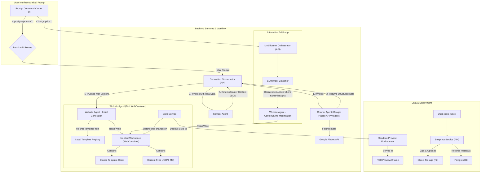

### **HuskIT Engineering Execution Plan: Phase 1 - The Interactive Template-Based MVP**

This document provides the complete technical specification, architecture, and sprint-level execution plan for Phase 1 of the HuskIT platform. The core strategy is to combine a library of premium, pre-built website templates with our three-agent AI system (`Crawler`, `Content`, `Website`) to deliver an interactive and reliable website creation experience.

### 1. Goal & Success Metrics

**Primary Goal:** To build and launch an MVP that allows non-technical users to generate a professional website by having our AI intelligently select, populate, and customize a premium template. The platform's key differentiator will be its ability to synthesize real customer reviews into compelling marketing content. The user can then iteratively refine all aspects of the site using natural language commands.

**Success Metrics:**
1.  **User Engagement & Success Rate:** 80% of our 50 test users successfully make at least one iterative edit. 95% of all content-related edit attempts (e.g., "change the price," "update hours") result in the correct update.
2.  **Reliability & Quality:** 100% of initial generations build successfully. The final websites are performant, fully responsive, and visually polished, reflecting the high quality of the underlying templates.
3.  **Performance:**
    *   **Initial Generation:** The end-to-end process from prompt submission to live preview is completed in under 3 minutes.
    *   **Iterative Edit:** Content and style edits are reflected in the live preview in under 20 seconds.
4.  **Acquisition:** Successfully onboard at least 50 early-adopter restaurants for structured user testing and feedback.

### 2. User Story

"As a non-technical restaurant owner, I want to provide my business's Google Maps and website links. I expect HuskIT to **crawl** them, read my customer reviews, and understand what people love most. Then, it should **intelligently select** the perfect template and **fill it** with AI-generated marketing copy that uses my customers' own words, a beautiful hero image, my menu, and a testimonials section featuring my best reviews. From a simple command center, I want to see the live preview and tell the AI, **'Change the price of the lasagna to $18,'** and see the changes happen instantly. When I'm happy, I want to save this version of my site."

### 3. Database Schema Design (Initial Version)

We will use a PostgreSQL database. The following schemas are foundational. `id` fields are UUIDs, and all timestamps are in UTC.

**`users` Table:**
*Purpose: Represents the authenticated user managing the site. Extensions to Supabase Auth.*

| Column Name | Data Type | Constraints | Description |
| :--- | :--- | :--- | :--- |
| `id` | `UUID` | Primary Key | References `auth.users.id`. Unique identifier. |
| `email` | `VARCHAR(255)` | NOT NULL, UNIQUE | User's email address. |
| `auth_provider_id` | `VARCHAR(255)` | | ID from external auth provider (e.g. Supabase Auth). |
| `tenant_id` | `UUID` | Foreign Key (tenants.id) | Links user to a tenant organization. |
| `role` | `VARCHAR(50)` | DEFAULT 'owner' | User role (owner, member). |
| `created_at` | `TIMESTAMPTZ` | NOT NULL, DEFAULT NOW() | |

**`tenants` Table:**
*Purpose: Represents a single customer/business entity on our platform.*

| Column Name | Data Type | Constraints | Description |
| :--- | :--- | :--- | :--- |
| `id` | `UUID` | Primary Key | Unique identifier for the tenant. |
| `business_name` | `VARCHAR(255)` | NOT NULL | The official name of the business. |
| `status` | `VARCHAR(50)` | NOT NULL, DEFAULT 'active' | e.g., 'active', 'suspended', 'archived'. |
| `created_at` | `TIMESTAMPTZ` | NOT NULL, DEFAULT NOW() | Timestamp of creation. |
| `updated_at` | `TIMESTAMPTZ` | NOT NULL, DEFAULT NOW() | Timestamp of last update. |

**`business_profiles` Table:**
*Purpose: Stores the structured, cleaned, and AI-enhanced data that defines a tenant's brand and operational details. This table is the "single source of truth" for a generated website.*

| Column Name | Data Type | Constraints | Description |
| :--- | :--- | :--- | :--- |
| `id` | `UUID` | Primary Key | Unique identifier for the profile. |
| `tenant_id` | `UUID` | Foreign Key (tenants.id) | Links to the owning tenant. |
| `google_place_id` | `VARCHAR(255)` | | Google Places ID for reliable data fetching. |
| `gmaps_url` | `VARCHAR(2048)` | | The source Google Maps URL. |
| `logo_url` | `VARCHAR(2048)` | | URL of the crawled or uploaded business logo. |
| `contact_info` | `JSONB` | | `{"phone": "...", "email": "..."}` |
| `address` | `JSONB` | | `{"street": "...", "city": "...", "zip": "..."}` |
| `hours_of_operation`| `JSONB` | | Structured hours for each day of the week. |
| `ai_generated_copy` | `JSONB` | NOT NULL | `{"hero_headline": "...", "about_story": "...", "testimonials_intro": "..."}` |
| `ai_extracted_themes`| `JSONB` | | `{"themes": ["cozy atmosphere", "family friendly", ...], "popular_dishes": [...]}` |
| `menu` | `JSONB` | | `[{"category": "Appetizers", "items": [{"name": "...", "price": "...", "description": "..."}]}, ...]` |
| `gallery_images` | `JSONB` | | `[{"url": "...", "alt_text": "..."}, ...]` |
| `testimonials` | `JSONB` | | `[{"quote": "...", "author": "..."}, ...]` |
| `design_system` | `JSONB` | | `{"primary_color": "#...", "secondary_color": "#...", "font_family": "..."}` |
| `created_at` | `TIMESTAMPTZ` | NOT NULL, DEFAULT NOW() | Timestamp of creation. |
| `updated_at` | `TIMESTAMPTZ` | NOT NULL, DEFAULT NOW() | Timestamp of last update. |

**`site_snapshots` Table:**
*Purpose: Stores saved versions of the generated website for restoration or publishing.*

| Column Name | Data Type | Constraints | Description |
| :--- | :--- | :--- | :--- |
| `id` | `UUID` | Primary Key | Unique identifier for the snapshot. |
| `tenant_id` | `UUID` | Foreign Key (tenants.id) | Links to the tenant. |
| `business_profile_id` | `UUID` | Foreign Key (business_profiles.id) | The profile data used. |
| `template_id` | `VARCHAR(255)` | | ID of the template used. |
| `workspace_archive_url`| `VARCHAR(2048)`| | URL to the zipped workspace in Object Storage (R2/S3). |
| `version_label` | `VARCHAR(255)` | | User-friendly label (e.g., "v1", "Summer Menu"). |
| `created_at` | `TIMESTAMPTZ` | NOT NULL, DEFAULT NOW() | |

**`crawled_data` Table:**
*Purpose: A temporary storage layer for the raw, unstructured data collected by the Crawler Agent. This allows us to re-process data without re-crawling, aiding in debugging and iteration.*

| Column Name | Data Type | Constraints | Description |
| :--- | :--- | :--- | :--- |
| `id` | `UUID` | Primary Key | Unique identifier for the crawl job. |
| `tenant_id` | `UUID` | Foreign Key (tenants.id) | Links to the tenant being crawled. |
| `source_url` | `VARCHAR(2048)`| NOT NULL | The URL that was crawled (e.g., Google Maps). |
| `raw_data_blob` | `JSONB` | NOT NULL | The complete, raw JSON output from the crawling tool. |
| `status` | `VARCHAR(50)` | NOT NULL | 'pending', 'completed', 'failed'. |
| `crawled_at` | `TIMESTAMPTZ` | NOT NULL, DEFAULT NOW() | Timestamp of the crawl. |

---

### 3. System Architecture & The Three-Agent Workflow

Our architecture is a robust pipeline where the AI's role is to act as an intelligent "customizer" of high-quality, pre-existing code, ensuring reliability and a premium end-product.

**Implementation Note:** The "Orchestrator" logic is implemented via **Remix API Routes** (server-side loaders/actions). **CRITICAL:** To avoid Cloudflare Pages Function timeout limits (typically 10-30s), these routes **MUST use Server-Sent Events (SSE) and the `SwitchableStream` pattern** (similar to `api.chat.ts`) to stream progress updates and keep the connection alive during long-running agent tasks.



### 4. Detailed Component Specifications

#### **`Premium Template Library`**
A core, human-engineered asset guaranteeing output quality.
*   **Technology:** 10 distinct, production-grade React/Vite applications stored directly in the repository (`/templates`).
*   **Architecture:** Each template is architected for AI manipulation.
    *   **Content Separation:** All content is read from local, well-structured JSON or Markdown files (e.g., `src/data/content.json`).
    *   **Styling Abstraction:** All design tokens are defined in a central theme file (e.g., `src/theme.js`) for programmatic modification.
    *   **Registry:** A simple configuration file lists available templates and their metadata.
*   **Features:** Each template includes a **Testimonials component** designed to display customer reviews, is fully responsive, and is built with best-in-class SEO practices.

#### **`Crawler Agent` (The Investigator)**
The foundational data gatherer.
*   **Function:** A server-side service (API Route) that acts as a wrapper around the **Google Places API** (and optionally SerpAPI). It does **not** perform brittle HTML scraping.
*   **Specific Data Points:**
    *   Business info (Name, Address, Phone, Hours) via Google Places.
    *   Reviews: High-quality, verified user reviews fetched directly from the Places API.
    *   Photos: Photo references from Google Places.
    *   **Cost Control:** The agent MUST implement strict limits (e.g., max 10 photos, max 50 reviews) and caching (via `crawled_data`) to prevent runaway API costs.
    *   Menu: (Future/Best Effort) Extracted from photos or website text if available via API.

#### **`Content Agent` (The AI Creative Director)**
Transforms raw data into a structured, actionable plan for customization.
*   **Process:**
    1.  **Thematic Synthesis:** **Performs thematic analysis on all crawled reviews to identify key strengths** (e.g., "popular dishes," "great service," "cozy ambiance"). It also identifies the most positive and representative quotes for the testimonials section.
    2.  **Template Matching:** Uses the brand archetype derived from the analysis to select the most suitable template from the `Premium Template Library`.
    3.  **Creative Asset Generation:**
        *   **Copywriting:** **Synthesizes these themes into 3-5 distinct paragraphs of compelling marketing copy** for the hero section, "About Us," etc. **Generates concise, enticing descriptions for 5-10 key menu items based on review mentions.**
        *   **Design System:** Analyzes the business logo and brand archetype to generate a complete `theme.js` file.
        *   **Generative Imagery:** **Generates a high-quality, brand-aligned Hero Image** for the website's main landing page and creates professional images for menu items that lack them.
*   **Output:** The **Master Content JSON**. This rich file contains the selected template name, the theme file content, and all structured content, including the synthesized marketing copy and a curated list of the best reviews for the testimonials component.

#### **`Website Agent` (The Template Customizer)**
Orchestrates the customization and build process within an isolated workspace using **WebContainers**.
*   **Initial Generation:**
    1.  Receives the Master Content JSON.
    2.  **Mounting:** Copies the selected template files from the repo into the WebContainer instance.
    3.  **Injection:** Writes all the new content and theme files, overwriting the template's defaults.
*   **Content/Style Modification Loop:**
    1.  Receives a user prompt (e.g., "change the price of lasagna").
    2.  The `LLM Intent Classifier` translates this into a structured command: `{ "action": "update_file", "file": "src/data/content.json", "path": "menu.items[5].price", "value": "$18" }`.
    3.  The Website Agent executes this command, programmatically updating the specified file in the WebContainer.
*   **Build Service:** A process that watches the workspace for file changes and triggers the fast-refresh development server to instantly update the sandbox preview.

### 5. Detailed Phase 1 Sprint Plan

*   **Sprint 1 (2 weeks): The Foundation - Templates & Crawling**
    *   **Goal:** Build the high-quality assets and the data ingestion pipeline.
    *   **Tasks:**
        *   **Architect the Template Standard:** Define the strict data schema that all templates will use, including a structure for `testimonials`.
        *   **Build 3 Premium Templates:** Develop three fully functional templates conforming to the standard.
        *   **Build the `Crawler Agent`:** Ensure it reliably extracts business info, menus, up to 50 reviews, and photos from Google Maps and websites.

*   **Sprint 2 (2 weeks): The Creative Bridge & Initial Generation**
    *   **Goal:** Achieve the first end-to-end generation of a fully customized website.
    *   **Tasks:**
        *   **Implement the full `Content Agent` logic:** Focus on the thematic review analysis, copy synthesis, and testimonial selection.
        *   Implement template matching and the generation of all content and theme files.
        *   Build the `Website Agent's` initial generation logic (template cloning and file injection).
        *   **Milestone:** A script can take a URL, and it correctly selects, populates (with review-driven copy), and customizes a template, outputting a build locally.

*   **Sprint 3 (2 weeks): The Interactive Loop & Cloud Preview**
    *   **Goal:** Build the core interactive editing feature and connect it to the user interface.
    *   **Tasks:**
        *   Develop the `Modification Orchestrator` and the `LLM Intent Classifier`.
        *   Implement the file-updating logic in the `Website Agent`.
        *   Develop the two-pane PCC front-end UI.
        *   Implement the `Build Service` and connect it to the cloud sandbox preview environment.
        *   **Milestone:** A user can generate a site via the UI and then successfully modify content and styles using natural language prompts.

*   **Sprints 4-6 (6 weeks): Scale Content, Harden, and Onboard**
    *   **Goal:** Build out the full template library, refine the AI, and prepare for real users.
    *   **Tasks:**
        *   Develop the remaining 7 premium website templates.
        *   Integrate the generative Hero Image and product imagery models into the `Content Agent`.
        *   Conduct intensive testing of the `LLM Intent Classifier` to ensure high accuracy.
        *   Implement the "Save Version" snapshotting service.
        *   Begin onboarding the first 50 users, gathering critical feedback on the quality of the AI-generated copy and the ease of use.

---

## Appendix: Google Places Crawler Service (Feature 001-places-crawler)

**Added**: 2025-11-23
**Feature Spec**: [`specs/001-places-crawler/spec.md`](../../specs/001-places-crawler/spec.md)

### Overview

This appendix documents the internal Places Data Service integration for the Google Places Crawler Service feature. This service extends the original Crawler Agent to support multi-source data aggregation (Google Maps, legacy websites, social profiles) through an internal REST API.

### Internal Places Data Service Setup

#### Service Overview

The Internal Places Data Service is a REST API that aggregates business profile data from multiple sources:
- **Google Maps** (primary source)
- **Legacy restaurant websites** (optional)
- **Social media profiles** (Facebook, Instagram, optional)

The crawler agent in this Remix application acts as a client to this internal service, mediating between the orchestration layer and the data aggregation layer.

#### Environment Configuration

Add these variables to your `.env.local`:

```bash
# Internal Places Data Service (required for crawler agent)
INTERNAL_PLACES_SERVICE_URL=http://localhost:3001/api
INTERNAL_PLACES_SERVICE_TOKEN=dev_token_12345
```

**Production Configuration:**
```bash
INTERNAL_PLACES_SERVICE_URL=https://places-data.prod/api
INTERNAL_PLACES_SERVICE_TOKEN=[contact_security_team]
```

#### Sample API Requests

##### 1. Fetch Place Profile

**Endpoint**: `POST /crawler/fetch`

**Request**:
```bash
curl -X POST http://localhost:3001/api/crawler/fetch \
  -H "Content-Type: application/json" \
  -H "Authorization: Bearer dev_token_12345" \
  -d '{
    "tenantId": "550e8400-e29b-41d4-a716-446655440000",
    "sourceUrl": "https://maps.google.com/maps?cid=12345678901234567890",
    "placeId": "ChIJN1t_tDeuEmsRUsoyG83frY4",
    "forceRefresh": false,
    "requestedSections": ["identity", "contact", "hours", "menu"],
    "correlationId": "req_abc123"
  }'
```

**Success Response (200 OK)**:
```json
{
  "tenantId": "550e8400-e29b-41d4-a716-446655440000",
  "placeId": "ChIJN1t_tDeuEmsRUsoyG83frY4",
  "sourcesUsed": [
    {"type": "maps", "timestamp": "2025-11-23T10:30:00Z"},
    {"type": "website", "timestamp": "2025-11-23T10:30:05Z"}
  ],
  "freshness": "2025-11-23T10:30:05Z",
  "cacheHit": false,
  "sections": {
    "identity": {
      "data": {"name": "The Golden Spoon", "cuisine": "Italian"},
      "completeness": "complete"
    },
    "contact": {
      "data": {"phone": "+1-555-0123", "email": "info@goldenspoon.example"},
      "completeness": "complete"
    }
  },
  "missingSections": [],
  "quotaState": {"percentage": 0.45, "state": "healthy"}
}
```

**Error Responses**:

| Code | HTTP | Example |
|------|------|---------|
| `INVALID_INPUT` | 400 | `{"code": "INVALID_INPUT", "message": "Missing tenantId", "remediation": "Provide valid UUID"}` |
| `PLACE_NOT_FOUND` | 404 | `{"code": "PLACE_NOT_FOUND", "message": "No data found", "remediation": "Verify URL"}` |
| `QUOTA_EXCEEDED` | 429 | `{"code": "QUOTA_EXCEEDED", "message": "Daily quota exhausted", "remediation": "Retry after midnight UTC"}` |
| `UPSTREAM_ERROR` | 502 | `{"code": "UPSTREAM_ERROR", "message": "Google Maps API unavailable", "remediation": "Retry in 5 minutes"}` |

##### 2. Get Quota Status

**Endpoint**: `GET /crawler/quota?apiKeyAlias=default`

**Response**:
```json
{
  "apiKeyAlias": "default",
  "dailyLimit": 1000,
  "dailyConsumed": 450,
  "minuteLimit": 100,
  "minuteConsumed": 12,
  "warningThreshold": 0.8,
  "resetAt": "2025-11-24T00:00:00Z"
}
```

##### 3. Invalidate Cache

**Endpoint**: `POST /crawler/cache/invalidate`

**Request**:
```bash
curl -X POST http://localhost:3001/api/crawler/cache/invalidate \
  -H "Content-Type: application/json" \
  -H "Authorization: Bearer dev_token_12345" \
  -d '{
    "tenantId": "550e8400-e29b-41d4-a716-446655440000",
    "placeId": "ChIJN1t_tDeuEmsRUsoyG83frY4",
    "reason": "stale_data",
    "requestedBy": "operator@example.com"
  }'
```

**Response**: 204 No Content (success) or 404 Not Found (no cache entry)

### Template Tooling Verification

**Date**: 2025-11-23
**Status**: Baseline verification completed
**Updated**: 2025-11-23 (actual execution)

#### Prerequisites

The template scripts require `tsx` for TypeScript execution:
```bash
pnpm add -D tsx  # Already installed in this project
```

**package.json script configuration:**
```json
{
  "scripts": {
    "templates:clone": "pnpm exec tsx scripts/templates/clone-starters.ts",
    "templates:seed": "pnpm exec tsx scripts/templates/seed-registry.ts"
  }
}
```

#### Commands Executed

```bash
pnpm templates:clone   # Clone premium templates (creates placeholders)
pnpm templates:seed    # Update registry.json (generates empty registry)
```

#### Execution Results

**1. Template Clone (`pnpm templates:clone`)**

```
📦 Cloning starter templates...
Target: all templates
Force: false

📥 Cloning restaurant-classic from TODO: Add template source URL or path...
   ⚠️  TODO: Implement clone logic for restaurant-classic
   ✓ Created placeholder at templates/restaurant-classic
📥 Cloning bistro-elegant from TODO: Add template source URL or path...
   ⚠️  TODO: Implement clone logic for bistro-elegant
   ✓ Created placeholder at templates/bistro-elegant
📥 Cloning taqueria-modern from TODO: Add template source URL or path...
   ⚠️  TODO: Implement clone logic for taqueria-modern
   ✓ Created placeholder at templates/taqueria-modern

✓ Template cloning complete
```

**2. Template Seed (`pnpm templates:seed`)**

```
🌱 Seeding template registry...
Target: all templates
Validate: false
Force: false

⚠️  TODO: Implement template seeding logic
    - Scan templates directory
    - Extract template metadata
    - Validate template structure
    - Generate/update registry.json

✓ Created empty registry at templates/registry.json
```

#### Post-Execution State

**Directory Structure:**
```
templates/
├── bistro-elegant/
│   └── README.md (68 bytes)
├── registry.json (43 bytes)
├── restaurant-classic/
│   └── README.md (68 bytes)
└── taqueria-modern/
    └── README.md (68 bytes)
```

**Registry Contents** (`templates/registry.json`):
```json
{
  "version": "1.0.0",
  "templates": []
}
```

**Total Disk Usage**: ~250 bytes (placeholder READMEs only)

#### Analysis & Notes

**Current Status**: ⚠️ **Placeholder Implementation**

The template tooling scripts are currently in placeholder/TODO state:

1. **Clone Script**: Creates empty directory structure with README placeholders
   - No actual template content cloned
   - No git operations or file copying implemented
   - Source URLs marked as "TODO"

2. **Seed Script**: Generates empty registry
   - No template metadata extraction
   - No validation logic
   - Templates array is empty

**Required Implementation Work**:

1. **For `clone-starters.ts`**:
   - Add actual template source URLs (GitHub repos, local paths, etc.)
   - Implement git clone or file copy logic
   - Populate templates with real React/Vite content
   - Add template assets (CSS, images, components)

2. **For `seed-registry.ts`**:
   - Implement template directory scanning
   - Extract metadata from template manifests
   - Validate template structure against schema
   - Populate `registry.json` with template data

3. **Template Content Requirements** (per spec):
   - Each template should include:
     - Full React/Vite application structure
     - `src/data/content.json` for content separation
     - `src/theme.js` for design tokens
     - Testimonials component for reviews
     - Fully responsive layout
     - SEO best practices

**Impact on Crawler Feature**:
- ✓ **No blocker**: The crawler agent doesn't directly depend on templates
- ✓ **Downstream dependency**: Templates are used by Website Agent (later phase)
- ℹ️ **Note**: Template implementation can proceed in parallel with crawler development

#### Integration Notes

The crawler agent does not directly interact with templates, but the template system is required for downstream orchestration:

1. **Crawler** → Fetches business data
2. **Content Agent** → Generates copy using business data
3. **Website Agent** → Selects template from registry
4. **Orchestrator** → Merges content + template → generates site

### Error Handling Matrix

| Error Code | Handler Behavior |
|------------|------------------|
| `INVALID_INPUT` | Validate before API call, show PCC validation errors |
| `PLACE_NOT_FOUND` | Prompt user to verify URL, offer manual data entry |
| `QUOTA_EXCEEDED` | Show quota alert with retry-after time, log telemetry |
| `UPSTREAM_ERROR` | Retry with exponential backoff (max 3x), then show error |
| `NO_SOURCE_DATA` | Partial success, show missing sections in PCC |

### Security Checklist

- [ ] Store `INTERNAL_PLACES_SERVICE_TOKEN` in environment variables only
- [ ] Rotate tokens quarterly or on compromise
- [ ] Use HTTPS in production (TLS 1.2+)
- [ ] Validate tenant scope to prevent cross-tenant data leaks
- [ ] Respect quota limits to avoid service disruption

### Testing Recommendations

1. **Connectivity Test**:
   ```bash
   curl -I http://localhost:3001/api/health
   ```

2. **Authentication Test**:
   ```bash
   curl -X POST http://localhost:3001/api/crawler/fetch \
     -H "Authorization: Bearer invalid_token" \
     # Should return 401 Unauthorized
   ```

3. **Quota Warning Test**:
   - Consume 80% of daily quota
   - Verify next request includes quota warning

### Next Steps

1. Implement Phase 2 foundational tasks (T004-T007):
   - Supabase migration for `crawled_data` table
   - Environment variable validation
   - Internal Places Client wrapper
   - Telemetry helpers
2. Create integration tests for internal service client
3. Implement crawler agent schema validation using Zod

### References

- API Contract: [`specs/001-places-crawler/contracts/crawler-service.openapi.yaml`](../../specs/001-places-crawler/contracts/crawler-service.openapi.yaml)
- Feature Quickstart: [`specs/001-places-crawler/quickstart.md`](../../specs/001-places-crawler/quickstart.md)
- Implementation Plan: [`specs/001-places-crawler/plan.md`](../../specs/001-places-crawler/plan.md)