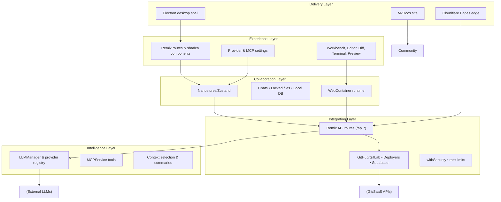
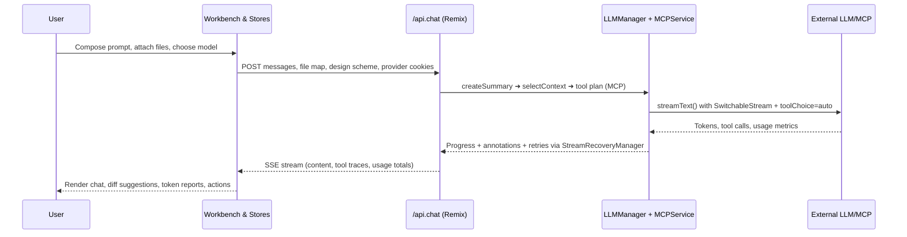
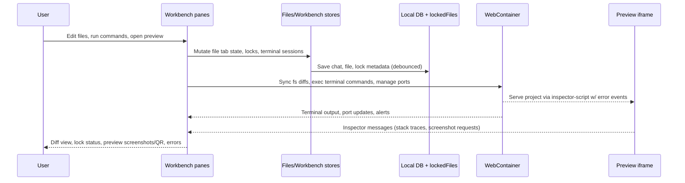
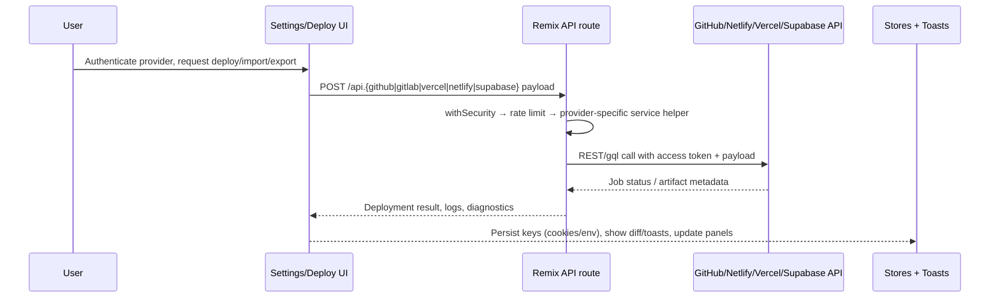

# bolt.diy System Overview

> High-level orientation for the bolt.diy codebase: surfaces, architecture, flows, and extensibility hooks.

## Intent & Audience
- Give new contributors a single-page mental model that links UI surfaces to server, AI, and integration layers.
- Highlight how major directories map to runtime responsibilities so feature plans can cite the right modules.
- Capture core flows (prompting, workspace, deployment) with diagrams for faster onboarding and spec writing.

## Platform Snapshot

| Domain | Details |
| --- | --- |
| Application type | Remix + React 18 front-end with multi-pane workbench, streamed chat, CodeMirror editor, and WebContainer-powered terminal/preview. |
| Runtime surfaces | Cloudflare Pages (`functions/[[path]].ts`), browser SPA, Electron shell (`electron/main`, `electron/preload`, `vite-electron.config.ts`), Docker images, and docs via MkDocs (`docs/`). |
| Languages & tooling | TypeScript-first repo (`pnpm` workspaces) with Vite, UnoCSS, shadcn/ui, Vitest/Playwright, Husky, Wrangler, and MkDocs (Poetry) for docs. |
| AI stack | Vercel AI SDK (`ai`), `LLMManager` + provider registry under `app/lib/modules/llm`, server orchestration in `app/lib/.server/llm/*`, tool calls via `MCPService`, context selection (`select-context.ts`), and resilient streaming (`SwitchableStream`, `StreamRecoveryManager`). |
| Workspace & state | Nanostores/Zustand stores (`app/lib/stores`), persistence helpers (`app/lib/persistence` for chats, locked files, local DB), cookie-backed provider settings, and `WORK_DIR=/home/project` coordination with WebContainer. |
| Integrations | GitHub/GitLab (`app/routes/api.github-*`, `api.gitlab-*`), Netlify/Vercel deployers, Supabase tooling, MCP, local model health monitor, import/export services, Expo QR, deployment modals, and CLI helpers in `scripts/`. |
| Security & quality | `withSecurity` middleware (`app/lib/security.ts`), rate limiting, CSP headers, file-locking UI, diff review, constitution-enforced lint/test/typecheck gates, and doc governance via `.specify/`. |

## Layered Architecture

### What lives in each layer
- **Experience**: `app/routes`, `app/root.tsx`, `app/components/{chat,workbench,editor,@settings,deploy,git,sidebar,header,ui}`, `app/styles/*`.
- **Collaboration & workspace**: `app/lib/stores/*`, `app/lib/persistence/*`, `app/lib/hooks/*`, `app/lib/webcontainer/*`, `app/components/workbench/*`.
- **Intelligence**: `app/routes/api.chat.ts`, `app/lib/.server/llm/*`, `app/lib/modules/llm/*`, `app/lib/services/mcpService.ts`, `app/utils/constants.ts`.
- **Integrations**: All `/api.*` Remix routes, `app/lib/services/*`, `app/lib/api/*`, `app/lib/modules/*` beyond LLM (Git, deploy, Supabase), `app/utils/security.ts`.
- **Delivery & tooling**: `functions/[[path]].ts`, `Dockerfile`, `docker-compose.yaml`, `scripts/*`, `electron/*`, `public/inspector-script.js`, `docs/*`, `.specify/*`.

## Component Catalog

| Layer | Path(s) | Responsibilities |
| --- | --- | --- |
| Experience & navigation | `app/routes/_index.tsx`, `app/root.tsx`, `app/components/sidebar`, `app/components/header` | Shell, routing, layout chrome, navigation shortcuts, global modals. |
| Prompting & collaboration | `app/components/chat/*`, `app/components/editor`, `app/components/workbench/DiffView.tsx`, `LockManager.tsx`, `Search.tsx` | Chat UI, code diff + locking, context search, apply/rollback flows, voice & file attachments. |
| Editor, terminal & preview | `app/components/editor/codemirror/*`, `app/components/workbench/terminal/*`, `Preview.tsx`, `InspectorPanel.tsx`, `FileTree.tsx`, `WebContainer` bootstrap | Code editing, multi-terminal tabs via xterm, preview iframe with inspector + screenshot tooling, file explorer/tree. |
| State & persistence | `app/lib/stores/*.ts`, `app/lib/persistence/{chats,lockedFiles,db}.ts`, `app/lib/hooks/use*`, `app/lib/persistence/useChatHistory.ts` | Session state, chat history, sync to IndexedDB/localStorage, optimistic updates, throttled persistence. |
| AI runtime | `app/routes/api.chat.ts`, `app/lib/.server/llm/**/*`, `app/lib/modules/llm/{manager,providers}`, `app/utils/constants.ts`, `app/utils/logger.ts` | Prompt assembly, context window trimming, provider abstraction, streaming (SwitchableStream), token accounting, progress annotations, logging. |
| Tooling & MCP | `app/lib/services/mcpService.ts`, `app/routes/api.mcp-*.ts`, `app/lib/runtime/{action-runner,message-parser}` | Model Context Protocol servers, tool invocation lifecycle, action runner parsing, resilience for auto-steps. |
| Integrations & deployments | `app/routes/api.{github,gitlab,netlify,vercel,supabase}*.ts`, `app/routes/api.git-info.ts`, `app/routes/api.webcontainer.*`, `app/components/deploy/*`, `app/components/git/*`, `app/lib/services/{githubApiService,gitlabApiService,importExportService,localModelHealthMonitor}.ts` | Repository sync, provider metadata, Netlify/Vercel deploy triggers, Supabase queries, WebContainer connections, local model status. |
| Security & observability | `app/lib/security.ts`, `app/utils/logger.ts`, `app/lib/services/localModelHealthMonitor.ts`, `app/components/workbench/Inspector.tsx` | Rate limiting, CSP headers, API sanitization, scoped logging, live preview alerts, telemetry hooks. |
| Delivery toolchain | `functions/[[path]].ts`, `Dockerfile`, `docker-compose.yaml`, `scripts/*.js`, `electron/*`, `assets/icons`, `package.json` scripts | Runtime glue (Cloudflare handler, Docker targets, electron builds, notarization, setup scripts). |
| Docs & governance | `docs/docs/*.md`, `docs/mkdocs.yml`, `.specify/templates/*`, `.specify/memory/constitution.md` | MkDocs site, governance, spec/plan/task templates, contributor workflow. |

## Key Application Flows

### Prompt-to-Response (chat orchestration)

- `createSummary` + `selectContext` shrink large workspaces while emitting `ContextAnnotation` events.
- `MCPService` injects tool definitions, pre-processes tool invocations, and streams tool-call annotations for the UI.
- `SwitchableStream` plus `MAX_RESPONSE_SEGMENTS` allow automatic continue prompts when token limits hit.
- Errors are normalized inside `api.chat` so the UI can render human-friendly guidance.

### Workspace, Terminal & Preview flow

- Files live under `/home/project`; `LockManager` coordinates exclusive edits via `lockedFiles`.
- `TerminalManager` multiplexes xterm instances, forwarding commands to WebContainer.
- Preview errors trigger notifications through `workbenchStore.actionAlert` for quick triage.

### Deployment & External Integration flow

- Git providers leverage `githubApiService`, `gitlabApiService`, and `importExportService` for cloning/exporting.
- Deploy panels share `app/components/deploy/*` UI plus `/api.vercel-deploy.ts`, `/api.netlify-deploy.ts`, etc.
- Supabase helpers (`app/routes/api.supabase*.ts`) expose SQL execution, credential checks, and environment sync.
- System diagnostics endpoints (`/api.system.*`) feed UI health checks and telemetry panels.

## Data, State & Persistence
- **Stores**: Nanostores manage real-time UI state (chat, streaming, previews, settings), while Zustand backs heavier client caches (workbench layout, theme, port mapping).
- **Persistence**: `app/lib/persistence/db.ts` (IndexedDB) plus `localStorage.ts` handle offline chat history, provider settings, and action logs. `lockedFiles.ts` enforces concurrency across AI/user edits.
- **Cookies & env**: Provider keys and settings round-trip via cookies (parsed inside `/api.chat`). `.env/.env.local` feed both Remix loaders and Cloudflare bindings; docs note `scripts/setup-env.sh` for Docker parity.
- **Server storage**: Cloudflare Pages functions stay stateless; long-lived data sits in the client (projects cloned into WebContainer) or is delegated to external services (GitHub, Supabase).

## Observability, Security & Quality Gates
- **Security middleware**: `withSecurity()` injects CSP/XFO headers, request-method guards, and configurable rate limits; helpers sanitize API-key errors before surfacing to clients.
- **Rate limiting**: Endpoint-specific quotas (LLM, GitHub, Netlify) protect shared API keys inside `app/lib/security.ts`.
- **Resilience**: `StreamRecoveryManager` watches SSE activity and retries stalled LLM streams; preview inspector surfaces stack traces from iframe contexts.
- **Governance**: `.specify/memory/constitution.md` enforces lint (`pnpm lint`), types (`pnpm typecheck`), and test (`pnpm test`) gates plus UX/perf standards that specs must reference.
- **Testing**: Vitest + Testing Library (unit/component), Playwright preview config, and dedicated scripts for smoke tests; CI runs via Wrangler/Cloudflare environments.

## Extensibility Map & Next Steps
- **LLM providers**: Add new classes under `app/lib/modules/llm/providers/*`, register via registry, and leverage shared streaming pipeline without touching UI code.
- **MCP tools**: Use `MCPService` to register custom servers or extend `app/routes/api.mcp-update-config.ts` to support new auth flows.
- **Workspace features**: Extend `app/components/workbench/*` panes (e.g., new inspectors or file actions) backed by `workbenchStore`.
- **Integrations**: New deployment targets or SaaS connectors fit the existing Remix API route + `withSecurity` + `app/lib/services` pattern.
- **Docs & specs**: Expand MkDocs nav (`docs/mkdocs.yml`) and `.specify/templates/*` to keep future `/speckit.plan` / `/speckit.specify` outputs aligned with this overview.

Use this document when drafting specs (`/speckit.specify`), reviewing plans, or onboarding contributors who need to understand how a prompt travels through bolt.diy’s stacks and into user-visible changes.

